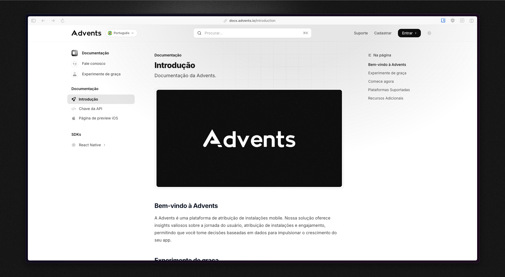

<h2 align="center">Advents</h2>

  The platform to grow your app.
   
  Advents is an alternative to AppsFlyer and Firebase Dynamic Links.
   
   
  <a href="https://advents.io/?utm_medium=social&utm_source=github&utm_campaign=docs-repo">Website</a>
  ·
  <a href="https://app.advents.io">Platform</a>
  ·
  <a href="https://docs.advents.io">Docs</a>
  ·
  <a href="https://www.youtube.com/watch?v=eYzF5tCwq_A">Demo</a>

 

This is the official repository for the Advents documentation.

The full documentation is available at:

[https://docs.advents.io](https://docs.advents.io)

## Contribution

1. Fork this repository
2. Make your changes to the `.mdx` files
3. Open a pull request with your proposed changes

We appreciate your contributions to improve our docs!

## License

This project is licensed under the GNU Affero General Public License Version 3 (AGPLv3) or any later version - see the [LICENSE](LICENSE.md) file for details.
